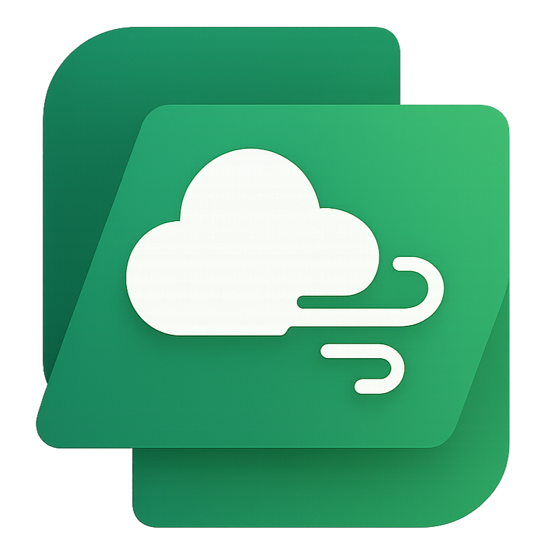

# AirQualityApp

Air Quality app，空气质量监测平台，查询当前及历史空气质量。

## 技术
解决方案采用 .NET 平台，使用 ASP.NET Core 搭建服务器端 Web API，使用 WinUI 3 构建 Windows 桌面客户端。

## 特点
1. 通过 WinUI 提供原生且美观的 Windows 应用体验。（WinUI 3 好看但是坑多，希望微软尽快把 bug 修了）
2. .NET 技术让服务端跨平台变得异常轻松。

## 开发原因
1. 解决实际问题，提升生活质量。
2. 学校课程需要交作业。*

注：* 为主要原因。

## 开源与贡献
本项目通过 [Apache 2.0 协议](LICENSE)开源，同时欢迎各位开发者为本项目贡献代码。  
我们鼓励您通过 Pull Request 为本项目添加新功能，或是进行问题修复。  
